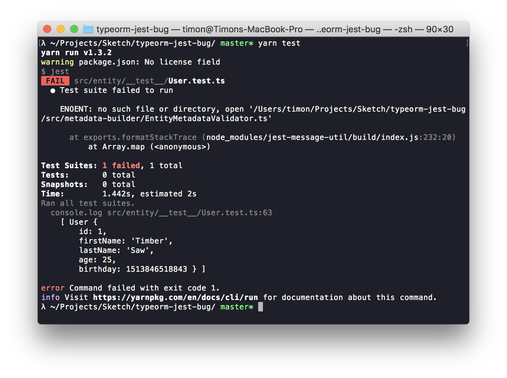
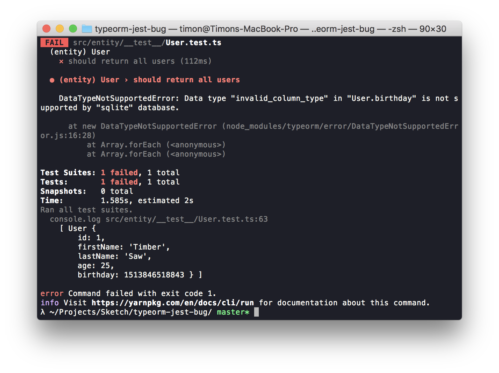

# TypeORM/Jest bug demo

1. Run `yarn` or `npm install` to install dependencies
2. Run `yarn start` to add a user to the database
3. Run tests with `yarn test`

Expected result:

We get an ENOENT error

4. Remove/rename `node_modules/typeorm/metadata-builder/EntityMetadataValidator.js.map`

Now we do get a proper error message:

